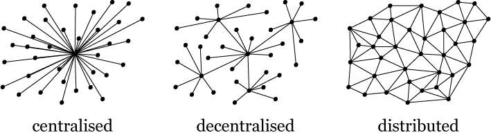

:css: ./default.css
:skip-help: true

.. title:: Git workshop

Git workshop
============

Filip Pytloun
-------------

----

Why Git?
========

* **Distributed** source control

* Very **fast** and efficient

* Scalable and extensible

* Multi-protocol support

  * SSH, HTTP, Git, file

* Git never deletes anything

  * there's not much destructive actions

* **Powerful** tool

  * of course such takes some time to learn

----

Basics
======

.. image:: ./images/git_workflow.png

----

Let's move to the practical part!
=================================

----

Prepare environment
===================

.. code-block:: bash

   mkdir workshop
   cd workshop

----

Setup repository that will act like remote
==========================================

.. code-block:: bash

   git init --bare remote
   echo "file://$(pwd)/remote"

``--bare`` switch creates repository without working directory

----

Clone your empty "remote" repository into local directory
=========================================================

.. code-block:: bash

   git clone file://$(pwd)/remote local

or the same result by adding remote into existing repository

.. code-block:: bash

   remote="file://$(pwd)/remote"
   mkdir local; cd local
   git init
   git remote add origin $remote

Show remote
-----------

.. code-block:: bash

   cd local; git remote -v

::

   origin	file:///home/filip/workshop/remote (fetch)
   origin	file:///home/filip/workshop/remote (push)

----

Make some changes
=================

Create file `test.py`
   .. code-block:: python

      #!/usr/bin/env python
      import __hello__

Show untracked files
   .. code-block:: bash

      git status -u

Stage files for commit
   .. code-block:: bash

      git add test.py
      git status

To un-add files, you can remove them from staging
    .. code-block:: bash

       git reset test.py

----

Make a commit
    .. code-block:: bash

       git commit -m "My first commit"
       git log
       git status

Push commits to remote
    .. code-block:: bash

       git push origin master

You can also push your ``HEAD`` to different branch, eg to create new branch
    .. code-block:: bash

       git push origin HEAD:develop

Then you can use it for creating merge requests for code-review, etc.  But
don't forget you still have changes not commited into currently tracked branch
``master``

You should also reference ticket id in your commit message. Each ticketing
system has different hooks. For example Taiga:

::

    My first commit, TG-123 #closed

----

Feature branches
================

It's usualy better to do work in separate feature branch and merge it into
upstream branch when your work is over.

Create new branch
    .. code-block:: bash

       git branch feature
       git checkout feature

Work on your feature, add some lines to ``test.py``
    .. code-block:: python

       import this
       love=this
       this is love

Show diff of your changes
    .. code-block:: bash

       git diff

Commit and push into your branch
    .. code-block:: bash

       git add -u
       git commit -m "What is love?"
       git push origin HEAD:feature

----

Fixing commits
==============

Look at your last commit, with extra informations
    .. code-block:: bash

       git show --pretty=fuller

Enhance your feature
    .. code-block:: python

       import antigravity

Update last commit in ``HEAD``
    .. code-block:: bash

       git add -u
       git commit --amend

What will now happen if you run following?
------------------------------------------

.. code-block:: bash

   git push origin feature

----

::

    To file:///home/filip/workshop/remote
     ! [rejected]        HEAD -> feature (non-fast-forward)
    error: failed to push some refs to 'file:///home/filip/workshop/remote'
    hint: Updates were rejected because the tip of your current branch is behind
    hint: its remote counterpart. Integrate the remote changes (e.g.
    hint: 'git pull ...') before pushing again.
    hint: See the 'Note about fast-forwards' in 'git push --help' for details.

You can't update commits that you already pushed into remote! Otherwise you
would change the history which is not a good idea and usualy not allowed.

But if you really want to force push to your branch or fork, you can. it will
also update merge request if you have created one.

.. code-block:: bash

   git push origin feature -f

----

Pulling changes
===============

Sync your feature branch with upstream master branch
    .. code-block:: bash

       git pull --rebase origin master

Always use ``--rebase`` option when pulling changes from remote, otherwise git
will create merge commit and mess up your commit log.

----

Merging branches
================

Let's say your feature is complete. You can let someone know about your merge
request and tell him to merge it or you may want to merge branches manually.

Checkout back to master and sync it with origin
    .. code-block:: bash

       git checkout master
       git pull --rebase

Simulate some changes in master branch that happened in a meanwhile
    .. code-block:: bash

       echo test > test1.py
       git add test1.py
       git commit -m "Meanwhile changes"
       git push origin master

Merge your feature branch into master
    .. code-block:: bash

       git merge feature

You can also merge remote branches
    .. code-block:: bash

       git pull origin feature

Notice the merge commit that appeared because we haven't used ``--rebase``
option which does pull first and then apply your commits.

----

Tags
====

Tag reference for object. Usualy used to determine versions.

Create tag
    .. code-block:: bash

       git tag v1.0

Push tag to origin
    .. code-block:: bash

       git push origin v1.0

You can also checkout tag as it would be branch. In fact you can checkout to
any object (eg. commit) if you like.

.. code-block:: bash

   git checkout -b version-1.0 v1.0
   git branch

----

Stash
=====

Stash is used to save local changes and use them later.
You need to stash your changes before pulling/rebasing.

Stash changes
    .. code-block:: bash

       git stash save "my changes"

List stash
    .. code-block:: bash

       git stash list

Pop changes out of stash
    .. code-block:: bash

       git stash pop 'stash@{0}'

----

Hard and soft reset
===================

You can use ``git reset`` to modify index and optinally working tree.

**Soft** reset doesn't touch working tree, only resets ``HEAD`` to given
commit

**Hard** reset resets both index and working tree. Any changes are discarded.

You can reset to commit or reference commit relatively
    .. code-block:: bash

       git reset --hard 58aa3aada4f20dfed36f2d78a123d5d7b287cbdd
       git reset --soft 'HEAD^1'

----

Reflog
======

Reflog is mechanism to record changes when branches are updated.

Even if you think you have lost something, eg. by hard reset, you are wrong.
Almost all changes can be undone with reflog.

Show reflog
    .. code-block:: bash

       git reflog

Use reflog hashes to reset
    .. code-block:: bash

       git reset --hard 729491c

Also this reset appears in ``reflog`` and can be undone :-)

----

Gitflow
=======

- Git workflow
- strict branching model
- robust and little bit more complicated than `Feature branch workflow`
- assigns specific role to branches

- `feature branches` or `forking workflow` can be still used to develop
  features and merge into develop

----

Branches in Gitflow
===================

``feature/*``
    feature branches, merged into develop. Best use ticket id as a reference.

``develop``
    where all development happens

``release/*``
    branched release from develop, merged into master

``master``
    production stable code

``hotfix/*``
    special hotfix branches, merged into master

----

.. image:: ./images/gitflow.png

----

Questions? :-)
==============

----

Reference
=========

- `Git flow cheatsheet <https://github.com/danielkummer/git-flow-cheatsheet>`_
- `Comparing workflows <https://www.atlassian.com/git/tutorials/comparing-workflows>`_
- `Taiga Gitlab integration <https://taiga.io/support/gitlab-integration/>`_
- `Changing history or how to Git pretty <http://justinhileman.info/article/git-pretty/>`_
